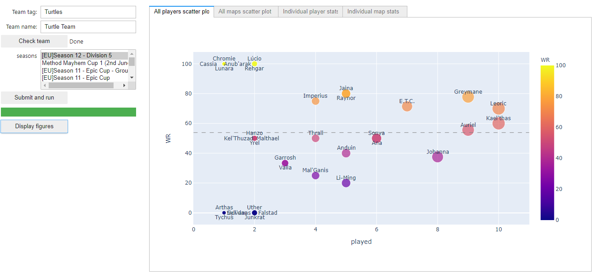

# HeroesLounge-TeamStats
A simple script to extract a team's  heroes statistics, per player and per map, from HeroesLounge.gg

The intent is to give insight on overperforming/underperforming heroes to help the drafting phase.

Now accessible through a Voilà dashboard

Try it here:

*Dashboard capture: global hero winrate & pickrate*

